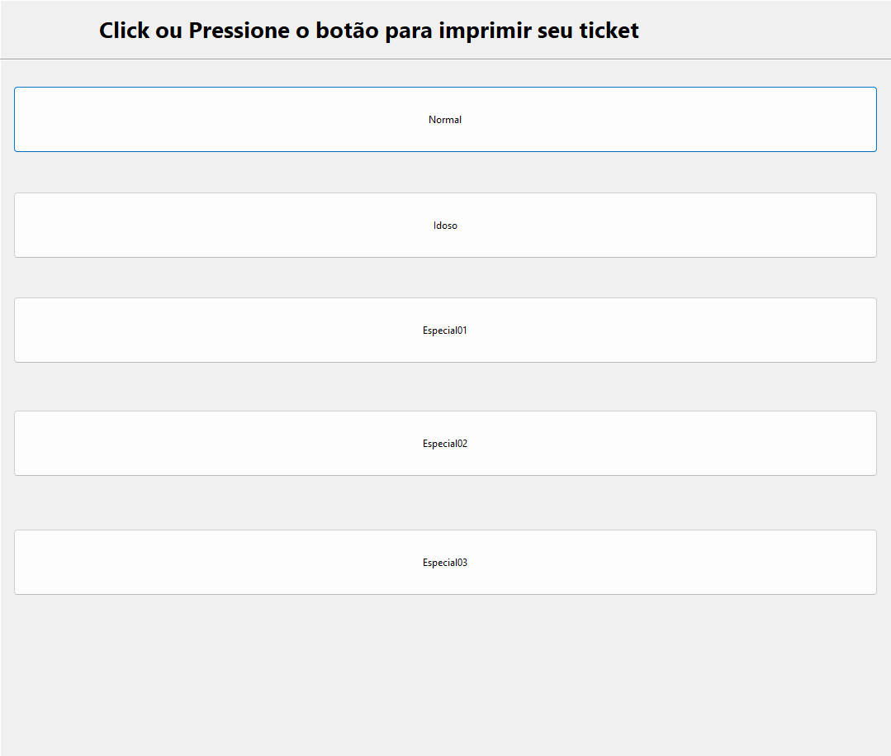
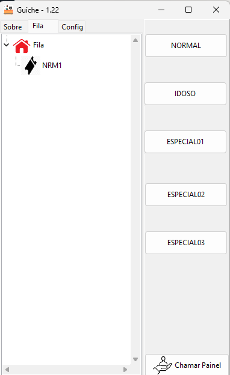
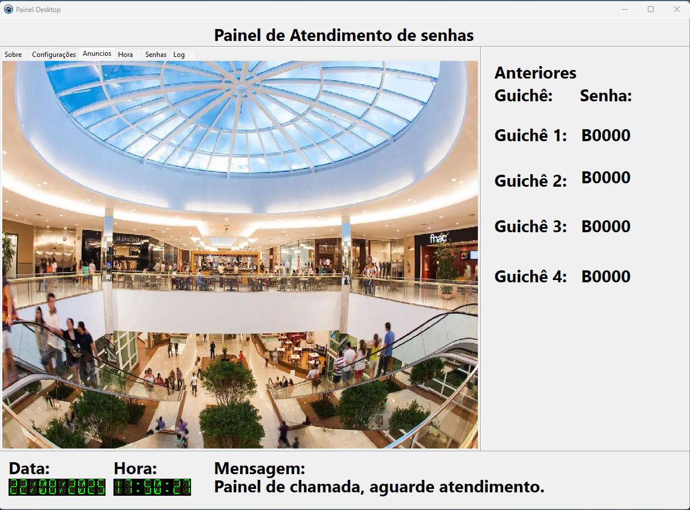

# Projeto Fila

Sistema simples de controle de filas, emissão de tickets e chamada de senhas, desenvolvido principalmente em **Lazarus / Free Pascal**.

O projeto foi criado para cenários de atendimento em balcão, recepção, unidades públicas, postos de atendimento ou qualquer ambiente onde seja necessário emitir uma senha, organizar a ordem de chamada e exibir a senha chamada em um painel.

Site do projeto: http://maurinsoft.com.br/index.php/projeto-fila/

Vídeo demonstrativo:

[](https://www.youtube.com/watch?v=wPoVD_J6qp4)

---

## Objetivo

O **Projeto Fila** permite controlar uma fila de atendimento usando três papéis principais:

1. **Terminal de emissão de senha** — gera e imprime o ticket do usuário.
2. **Guichê de atendimento** — solicita a próxima senha da fila.
3. **Painel de chamada** — exibe a senha chamada e o guichê correspondente.

O sistema foi pensado para ser simples, local e multiplataforma, podendo ser usado em Windows, Linux e, em parte do projeto, Android.

---

## Componentes do projeto

### 1. Fila

Aplicação principal do sistema.

Responsabilidades:

- emitir tickets de senha;
- controlar até cinco tipos de fila;
- imprimir senha em impressora térmica;
- manter a numeração atual das filas;
- armazenar a listagem pendente de senhas;
- atender requisições dos guichês;
- disponibilizar dados para o painel;
- permitir reset manual ou programado da numeração;
- permitir configuração de empresa, local, rótulos, imagem e impressora;
- opcionalmente acionar um executável externo para análise/evento de chamada.

Portas usadas pela aplicação principal:

| Porta | Uso |
|---:|---|
| `8095` | comunicação com o Guichê |
| `8096` | comunicação com Painel / consulta de painel |

A aplicação principal usa arquivos de configuração no diretório retornado por `GetAppConfigDir(false)` e salva as filas em arquivos como `list01.txt`, `list02.txt`, `list03.txt`, `list04.txt` e `list05.txt`.

Imagem:



---

### 2. Guichê

Aplicação usada pelo atendente.

Responsabilidades:

- conectar na aplicação **Fila**;
- solicitar a próxima senha de uma fila específica;
- rechamar a última senha;
- enviar a senha chamada para até três painéis configurados;
- manter histórico visual das senhas chamadas;
- gravar logs locais em arquivo;
- permitir configuração do IP do servidor Fila, IPs dos painéis e número do guichê.

Portas usadas pelo Guichê:

| Porta | Uso |
|---:|---|
| `8095` | conexão com o servidor Fila |
| `8196` | envio da senha chamada para o painel |

Imagem:



---

### 3. Painel

Aplicação destinada à exibição das senhas chamadas.

Responsabilidades:

- receber a senha chamada pelo Guichê;
- exibir número da senha e guichê;
- funcionar como painel visual em monitor, TV, tablet ou outro equipamento dedicado.

O repositório possui implementação de painel desktop e projeto Android/LAMW.

Imagem:



---

### 4. Contador

Módulo complementar existente no repositório. Deve ser tratado como componente auxiliar do ecossistema do projeto.

---

## Estrutura do repositório

```text
fila/
├── Contador/              # módulo auxiliar
├── Fila/                  # aplicação principal de emissão e controle de fila
├── Guiche/                # aplicação usada pelo atendente/guichê
├── Painel/Painel_Laz/     # painel baseado em Lazarus/LAMW
├── PainelDesk/            # painel desktop
├── bin/                   # binários e arquivos de distribuição
├── drivers/               # drivers e dependências externas
├── img/                   # imagens usadas na documentação
├── tools/SQLiteStudio/    # ferramenta auxiliar para SQLite
├── README.MD              # documentação principal
└── readme.txt             # instruções antigas relacionadas ao build Android/LAMW
```

---

## Tecnologias utilizadas

- **Lazarus / Free Pascal**
- **LCL**
- **lNet** / `lnetvisual`
- **Indy** / `indylaz`
- **Synapse** / `laz_synapse`
- **UniqueInstance**
- **RxLib** / `rxnew`
- **LazSerialPort**
- **DataPortLasarus**
- **Fortes Report for Lazarus**
- **LAMW** no módulo Android
- **Inno Setup** para empacotamento Windows
- scripts Batch e Shell auxiliares

O repositório contém código majoritariamente em Pascal, além de partes em Java, HTML, Inno Setup, Batchfile e Shell.

---

## Requisitos para compilar

### Ambiente recomendado

- Lazarus instalado;
- Free Pascal compatível com a versão do Lazarus usada;
- pacotes Lazarus exigidos pelos projetos;
- drivers de impressora térmica quando necessário;
- permissões de rede liberadas para as portas usadas;
- em Linux, permissão de acesso à porta serial, quando usada;
- em Android, ambiente LAMW configurado.

### Pacotes Lazarus usados pela aplicação Fila

O projeto `Fila/Fila.lpi` declara dependência dos seguintes pacotes:

- `laz_synapse`
- `uniqueinstance_package`
- `indylaz`
- `industrial`
- `rxnew`
- `LazSerialPort`
- `lnetvisual`
- `DataPortLasarus`
- `fortes324forlaz`
- `LCL`

### Pacotes Lazarus usados pelo Guichê

O projeto `Guiche/Guiche.lpi` declara dependência dos seguintes pacotes:

- `indylaz`
- `DataPortLasarus`
- `lnetvisual`
- `LCL`

---

## Como compilar

### Fila

1. Abra o Lazarus.
2. Abra o arquivo:

```text
Fila/Fila.lpi
```

3. Instale os pacotes exigidos, se o Lazarus solicitar.
4. Compile o projeto.
5. Execute a aplicação `Fila`.

---

### Guichê

1. Abra o Lazarus.
2. Abra o arquivo:

```text
Guiche/Guiche.lpi
```

3. Instale os pacotes exigidos.
4. Compile o projeto.
5. Execute a aplicação `Guiche`.

---

### Painel

O painel possui versões no repositório. Dependendo da versão usada, o processo pode envolver Lazarus desktop ou LAMW para Android.

Para o projeto Android/LAMW, consulte também o arquivo:

```text
readme.txt
```

Esse arquivo contém instruções antigas sobre build de APK com Ant e scripts do LAMW.

---

## Como executar o sistema

### 1. Execute a aplicação Fila

A aplicação **Fila** deve ser iniciada primeiro, pois ela atua como o núcleo do sistema.

Configure:

- nome da empresa;
- localização;
- tipos de fila;
- abreviações das filas;
- imagem/logotipo;
- impressora;
- tipo de papel;
- tipo de protocolo;
- opções de painel;
- reset programado, se necessário.

Depois, inicie o modo de operação.

---

### 2. Configure o Guichê

No Guichê, configure:

- IP da máquina onde a aplicação Fila está rodando;
- número do guichê;
- IP dos painéis, se houver;
- opção para enviar ou não as chamadas ao painel.

Quando o atendente clicar em uma fila, o Guichê enviará uma requisição para o servidor Fila e receberá a próxima senha disponível.

---

### 3. Configure o Painel

Configure o painel para receber a senha chamada.

O Guichê pode enviar a chamada para até três painéis configurados.

---

## Fluxo de funcionamento

```text
Usuário retira senha
        ↓
Aplicação Fila gera e imprime ticket
        ↓
Senha entra na lista da fila correspondente
        ↓
Atendente usa o Guichê para chamar próxima senha
        ↓
Guichê solicita a senha ao Fila pela porta 8095
        ↓
Fila remove a senha da lista e devolve ao Guichê
        ↓
Guichê exibe a senha e envia ao Painel pela porta 8196
        ↓
Painel mostra senha + número do guichê
```

---

## Tipos de fila

A aplicação principal trabalha com até cinco filas configuráveis.

Configuração padrão observada no código:

| Fila | Descrição padrão | Abreviação padrão |
|---:|---|---|
| 1 | Normal | AB1 |
| 2 | Idoso | AB2 |
| 3 | Especial1 | AB3 |
| 4 | Especia2 | AB4 |
| 5 | Especia3 | AB5 |

Esses nomes podem ser alterados pela tela de configuração.

---

## Impressoras suportadas

O projeto possui estrutura para diferentes modelos/modos de impressão.

Modelos e modos encontrados no código:

### Tipo de impressora

- driver do sistema;
- serial;
- bluetooth.

### Modelos

- Elgin i9;
- Elgin i7;
- genérica 58 mm.

### Papel

- 58 mm;
- 80 mm.

As units de impressão ficam na pasta:

```text
Fila/printer/
```

---

## Configuração

A aplicação principal usa o arquivo:

```text
fila.cfg
```

Esse arquivo é salvo no diretório de configuração da aplicação, retornado por:

```pascal
GetAppConfigDir(false)
```

Principais parâmetros gravados:

| Parâmetro | Função |
|---|---|
| `EMPRESA` | nome exibido no sistema/ticket |
| `LOCALIZACAO` | local de atendimento |
| `TIPO1` a `TIPO5` | nomes das filas |
| `ABREV01` a `ABREV05` | abreviações das filas |
| `HABILITA01` a `HABILITA05` | habilita ou oculta cada fila |
| `CONTAGEM1` a `CONTAGEM5` | numeração atual de cada fila |
| `COMPORT` | porta serial da impressora |
| `TIPOIMP` | modo de impressão |
| `MODELOIMP` | modelo da impressora |
| `TIPOPAPEL` | padrão do papel |
| `TIPOPROTOCOLO` | protocolo do painel |
| `IMAGEM` | imagem/logotipo |
| `RESET` | habilita reset programado |
| `HORA` | horário de reset |
| `FLGANALISE` | habilita integração com executável externo |
| `PATHANALISE` | caminho do executável externo |

---

## Integração externa de análise/evento

A aplicação Fila possui uma rotina para chamar um executável externo quando um evento de chamada acontece.

O executável recebe três parâmetros:

```text
<NROGuiche> <NroFila> <Tipo>
```

Uso previsto:

- registrar evento em outro sistema;
- enviar dados para um serviço externo;
- realizar análise complementar;
- integrar com auditoria, estatística ou painel adicional.

Essa integração depende da configuração `PATHANALISE`.

---

## Logs

O Guichê grava logs locais no diretório:

```text
logs/
```

Formato do arquivo:

```text
guiche_YYYY-MM-DD.log
```

Além disso, o log visual da aplicação é limitado para evitar consumo excessivo de memória.

---

## Rede e firewall

Para funcionamento em rede local, libere as portas:

| Porta | Origem | Destino | Finalidade |
|---:|---|---|---|
| `8095` | Guichê | Fila | solicitar próxima senha |
| `8096` | Painel/consulta | Fila | consultar dados do painel |
| `8196` | Guichê | Painel | enviar senha chamada |

Recomenda-se usar IP fixo nas máquinas ou reservar IP pelo roteador.

---

## Exemplo de implantação local

```text
Computador 1: Fila
IP: 192.168.0.10
Portas abertas: 8095 e 8096
Impressora térmica conectada

Computador 2: Guichê 1
Configuração:
  IP Fila: 192.168.0.10
  Nº Guichê: 1
  Painel 1: 192.168.0.20

Computador 3 / TV / Tablet: Painel
IP: 192.168.0.20
Porta: 8196
```

---

## Observações importantes

- A aplicação Fila deve ser iniciada antes do Guichê.
- O IP configurado no Guichê deve apontar para a máquina que executa a aplicação Fila.
- O firewall do sistema operacional pode bloquear a comunicação.
- Em Linux, portas seriais podem exigir permissões adicionais.
- A impressão depende do driver, porta e modelo da impressora térmica.
- O projeto mantém código legado e módulos antigos, especialmente no fluxo Android/LAMW.

---

## Status do projeto

O projeto é funcional e possui histórico de uso real, inclusive em ambiente público.

Empresa/órgão citado no README original:

- Secretaria da Saúde de Ribeirão Preto

---

## Melhorias recomendadas

Para evolução futura, recomenda-se:

- separar melhor documentação de usuário e documentação técnica;
- padronizar nomes de pastas e projetos;
- documentar protocolo de comunicação em arquivo próprio;
- criar releases com executáveis versionados;
- adicionar instruções específicas para Windows, Linux e Android;
- criar exemplos de configuração de rede;
- adicionar screenshots atualizados de cada módulo;
- revisar código legado do Android/LAMW;
- criar instalador atualizado para Windows;
- adicionar licença explícita ao repositório.

---

## Autor

Desenvolvido por **Marcelo Maurin Martins**.

GitHub: https://github.com/marcelomaurin

Site: http://maurinsoft.com.br/

---

## English summary

**Fila** is a queue management system developed mainly with Lazarus / Free Pascal.

It includes:

- a ticket issuing application;
- a counter/desk application to call the next ticket;
- a display panel to show the called ticket and counter number;
- support for thermal printers;
- local network communication;
- configurable queue types;
- desktop and Android/LAMW related modules.

Main ports:

- `8095`: counter to Fila server;
- `8096`: panel/query communication;
- `8196`: counter to display panel.

---

## Resumen en español

**Fila** es un sistema de control de turnos desarrollado principalmente con Lazarus / Free Pascal.

Incluye:

- aplicación para emisión de tickets;
- aplicación de mostrador/guiché para llamar el próximo número;
- panel de visualización;
- soporte para impresoras térmicas;
- comunicación en red local;
- tipos de fila configurables;
- módulos desktop y Android/LAMW.

Puertos principales:

- `8095`: comunicación entre Guiché y Fila;
- `8096`: comunicación/consulta del panel;
- `8196`: envío de llamada del Guiché al panel.
